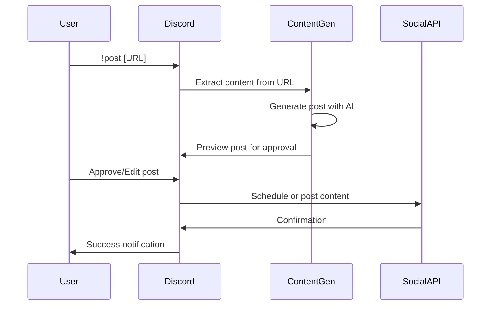
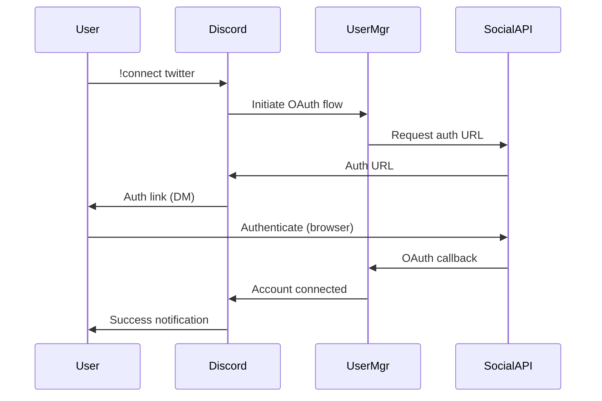

# Social Media Agent - Architecture

## System Overview

The Social Media Agent is designed with a layered architecture that separates concerns while enabling efficient communication between components. The system utilizes LangGraph for orchestrating AI workflows and Discord.js for user interactions.

```
┌───────────────────────────────────────────────────────────────────┐
│                         Discord Interface                          │
├───────────────┬───────────────┬────────────────┬─────────────────┤
│ Command       │ Message       │ Interaction    │ Notification    │
│ Handler       │ Parser        │ Responder      │ Service         │
└───────┬───────┴───────┬───────┴────────┬───────┴────────┬────────┘
        │               │                │                │
┌───────▼───────────────▼────────────────▼────────────────▼────────┐
│                           Core Controllers                        │
├──────────────┬─────────────────┬───────────────┬─────────────────┤
│ User         │ LangGraph       │ Social        │ Content         │
│ Manager      │ Executor        │ Connector     │ Scheduler       │
└──────┬───────┴────────┬────────┴───────┬───────┴────────┬────────┘
       │                │                │                │
┌──────▼────────────────▼────────────────▼────────────────▼────────┐
│                          Service Layer                            │
├──────────────┬─────────────────┬───────────────┬─────────────────┤
│ Content      │ Post            │ Analytics     │ Configuration   │
│ Generator    │ Publisher       │ Service       │ Manager         │
└──────┬───────┴────────┬────────┴───────┬───────┴────────┬────────┘
       │                │                │                │
┌──────▼────────────────▼────────────────▼────────────────▼────────┐
│                          Integration Layer                        │
├──────────────┬─────────────────┬───────────────┬─────────────────┤
│ Twitter      │ LinkedIn        │ Google Cloud  │ Storage         │
│ API          │ API             │ Services      │ Services        │
└──────────────┴─────────────────┴───────────────┴─────────────────┘
```

## Component Descriptions

### Discord Interface

- **Command Handler**: Processes discord commands and routes them to appropriate controllers
- **Message Parser**: Extracts user intent and parameters from natural language messages
- **Interaction Responder**: Manages buttons, menus, and other interactive elements
- **Notification Service**: Sends proactive notifications to users and channels

### Core Controllers

- **User Manager**: Handles user authentication, profile management, and permissions
- **LangGraph Executor**: Orchestrates AI workflows for content generation and processing
- **Social Connector**: Manages connections to social media platforms
- **Content Scheduler**: Handles scheduling and queuing of posts

### Service Layer

- **Content Generator**: Creates posts based on input URLs and user preferences
- **Post Publisher**: Handles the actual posting to social media platforms
- **Analytics Service**: Tracks post performance and user engagement
- **Configuration Manager**: Manages system and user-specific settings

### Integration Layer

- **Twitter API**: Handles all Twitter-specific operations
- **LinkedIn API**: Manages LinkedIn connectivity and posting
- **Google Cloud Services**: Interfaces with Vertex AI and other Google services
- **Storage Services**: Persists data using database and file storage

## Data Flow

### Post Generation Flow



### Authentication Flow



## Database Schema

### Users
```
┌─────────────────┬────────────┐
│ id              │ string     │
│ discord_id      │ string     │
│ display_name    │ string     │
│ twitter_token   │ string     │
│ linkedin_token  │ string     │
│ created_at      │ timestamp  │
│ updated_at      │ timestamp  │
│ preferences     │ json       │
└─────────────────┴────────────┘
```

### Posts
```
┌─────────────────┬────────────┐
│ id              │ string     │
│ user_id         │ string     │
│ content         │ text       │
│ original_url    │ string     │
│ image_url       │ string     │
│ platforms       │ string[]   │
│ scheduled_for   │ timestamp  │
│ posted_at       │ timestamp  │
│ status          │ enum       │
│ metadata        │ json       │
└─────────────────┴────────────┘
```

## AI Components

### LangGraph Nodes

The system utilizes LangGraph for orchestrating AI workflows:

1. **verifyLinksSubGraph**: Validates and extracts content from submitted URLs
2. **generatePostSubGraph**: Creates social media post content from extracted information
3. **humanNode**: Facilitates user interaction for approval/editing
4. **schedulePost**: Handles date selection and scheduling
5. **uploadPost**: Manages the actual publishing process

### Vertex AI Integration

The system uses Google's Vertex AI for various AI capabilities:

1. **Text Generation**: Creating engaging social media posts
2. **Content Analysis**: Understanding input content
3. **Entity Recognition**: Identifying key topics and mentions
4. **Sentiment Analysis**: Ensuring appropriate tone for posts

## Configuration Management

### Environment Variables
- Social media API keys
- Discord bot token
- Database connection details
- AI service credentials
- Feature flags

### User Preferences
- Default posting times
- Content style preferences
- Auto-approval settings
- Notification preferences

## Security Considerations

1. **Authentication**: OAuth 2.0 for all social media connections
2. **Data Storage**: Encrypted storage of user tokens and sensitive data
3. **Permission Model**: Role-based access controls for multi-user scenarios
4. **API Security**: Rate limiting and request validation

## Deployment Architecture

For Google Cloud Run deployment, the system is containerized with Docker and configured for stateless operation with external persistence:

```
┌─────────────────────────────────────────────────────────┐
│                     Google Cloud Run                     │
│                                                         │
│  ┌─────────────┐       ┌─────────────┐                  │
│  │ Social Media│       │ LangGraph   │                  │
│  │ Agent       │◄─────►│ Server      │                  │
│  └─────────────┘       └─────────────┘                  │
│          ▲                     ▲                        │
└──────────┼─────────────────────┼────────────────────────┘
           │                     │
┌──────────▼─────┐     ┌─────────▼────────┐
│  Firestore     │     │ Vertex AI        │
│  Database      │     │                  │
└────────────────┘     └──────────────────┘
           ▲                     ▲
           │                     │
┌──────────▼─────┐     ┌─────────▼────────┐
│  Twitter API   │     │ LinkedIn API      │
│                │     │                   │
└────────────────┘     └───────────────────┘
```

## Future Architecture Considerations

1. **Scalability**: Move to a microservices architecture for high volume usage
2. **Multi-tenancy**: Support for agencies managing multiple clients
3. **Analytics Engine**: Enhanced performance tracking and reporting
4. **Plugin System**: Extensible architecture for additional platforms 